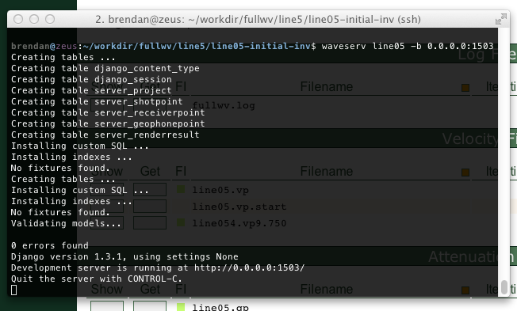

.. _cli:

Command Line Interface
======================

The :program:`waveserv` CLI is a Python program that loads up a specially modified web server.  However, instead of hosting a web site, this interface looks for `Waveform Tomography <http://orion.es.uwo.ca/index.php/Waveform_Tomography>`_ project files and generates an interactive listing.

You may run :program:`waveserv` by navigating to the directory containing FULLWV/OMEGA files and typing :command:`waveserv [projnm]`, where **[projnm]** is the name associated with the **\*.ini** file.  It can also auto-detect this if there is only one project in the directory, but this fails (for example) during inversion because of the generation of **tmp.*** files.

Access the :ref:`gui` by pointing a web browser at `<http://localhost:1503/>`_ (by default), or use the command-line interface to change the port ("waveserv --help").  If the server is not running on the local machine (i.e., your web browser is not on the machine that OMEGA/FULLWV runs on), you can specify the bind address as something other than **127.0.0.1**.  This is a potential security issue, so in most cases it is better to use VPN (Virtual Private Networking, e.g., `OpenVPN <http://openvpn.net/>`_) or SSH-tunnel methods to access it from the local machine.  To set up a SSH tunnel, issue the following command on the machine running the web browser::

   ssh -f -N -L 1503:localhost:1503 [remotehost]

In this case, connect to the address `<http://localhost:1503/>`_ as if you were running :program:`waveserv` on the same computer.

   Example execution of :program:`waveserv`, for a project named *line05*.

.. warning::
   :program:`waveserv` is based on the `Django <http://www.djangoproject.com/>`_ test web server.  This is designed for development use, and is not recommended for use on public networks (viz., the Internet).  `Django <http://www.djangoproject.com/>`_ is a popular project, and its vulnerabilities may be well-known; :program:`waveserv` is susceptible to the same issues.  By default, :program:`waveserv` is only accessible from the local computer, and so is only accessible to other users with accounts on the server/workstation.  The :option:`-b` option should only be used on a secure network.

Options
-------

.. program:: waveserv

.. option:: --version
   show program version number and exit

.. option:: -h, --help
   show a help message and exit

.. option:: -v, --verbose
   display additional information

.. option:: -b ADDR, --bind=ADDR
   server address to bind [Default: 127.0.0.1:1503]

.. option:: -d FILE, --db=FILE
   filename for server database [Default: .waveserv.db]

.. option:: -g, --serverdebug
   enable debugging for web server

.. option:: -k, --keep
   keep temporary files on exit [Default: False]

.. option:: -p DIBUPATH, --dibupath=DIBUPATH
   path for temporary image files [Default: .buffer]
