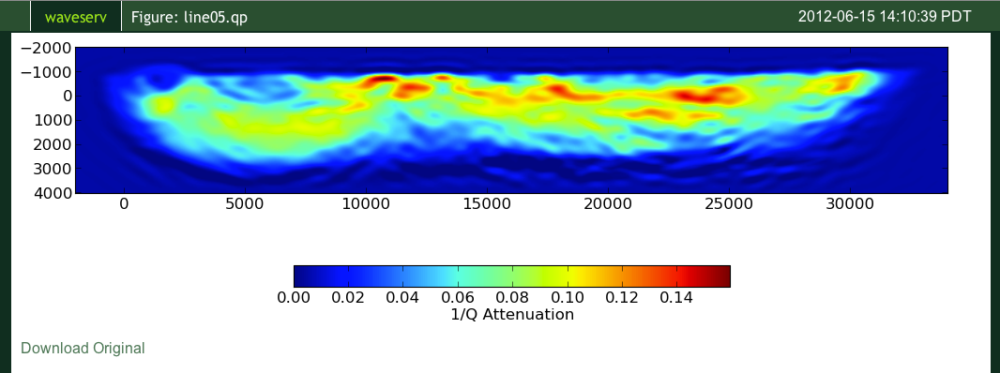

.. _gui:

Graphical User Interface
========================

The :program:`waveserv` program directly indexes and reads the (SEG-Y) files in the directory working directory on the server, handling endian and floating point conversion, and provides a directory listing through the web-browser interface.  The web-based GUI is rendered by the :program:`waveserv` executable, which is started using a :ref:`cli`.

With the :program:`waveserv` server running, navigate to `<http://localhost:1503/index>`_ to show the directory listing:

.. figure:: images/listing.png

   Directory listing rendered by :program:`waveserv`.

Each type of file is grouped under a descriptive heading, and the entries under each heading are sorted.  Several pieces of information are available for each entry, including the *filename*, *size*, and *modification time*.  Additionally, for files that correspond to a particular *frequency* or *iteration*, this information is extracted from the filename.  Each of these headings can be used as a sort key; simply click the corresponding check box (beside the column heading) to change the sort key.  The current sort key is indicated by a box that is coloured differently from the others.

.. versionadded:: 1.1
   An indicator shows the freshness of each file graphically.

Each entry has two buttons, labelled *Show* and *Get*.  Clicking the *Get* button simply downloads the original file.  The *Show* button beside an entry displays a graphical representation of the file.  This takes you to `<http://localhost:1503/show/filename>`_ for a file *filename*, which is a web address that calls a plotting method, which generates a PNG image.

   Example plot for an attenuation (1/Q) model, for the project *line05*.
